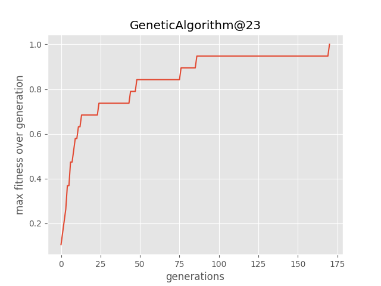

# Evolutionary-algorithm

## Password Cracker

#### CrakingPassword problem with genetic algorithm
- https://en.wikipedia.org/wiki/Genetic_algorithm

## Instructions

### Create virtualenv (recommended)

```
$ virtualenv -p python3.6 myenv
$ source myenv/bin/activate
(myenv)$ pip install -r requirements.txt
```

### Cracker CLI

```
(myenv)$ python crack_code.py --help

usage: CrackPassword [-h] [-p POPULATION] -t TARGET

██████╗  █████╗ ███████╗███████╗██╗    ██╗ ██████╗ ██████╗ ██████╗      ██████╗██████╗  █████╗  ██████╗██╗  ██╗███████╗██████╗ 
██╔══██╗██╔══██╗██╔════╝██╔════╝██║    ██║██╔═══██╗██╔══██╗██╔══██╗    ██╔════╝██╔══██╗██╔══██╗██╔════╝██║ ██╔╝██╔════╝██╔══██╗
██████╔╝███████║███████╗███████╗██║ █╗ ██║██║   ██║██████╔╝██║  ██║    ██║     ██████╔╝███████║██║     █████╔╝ █████╗  ██████╔╝
██╔═══╝ ██╔══██║╚════██║╚════██║██║███╗██║██║   ██║██╔══██╗██║  ██║    ██║     ██╔══██╗██╔══██║██║     ██╔═██╗ ██╔══╝  ██╔══██╗
██║     ██║  ██║███████║███████║╚███╔███╔╝╚██████╔╝██║  ██║██████╔╝    ╚██████╗██║  ██║██║  ██║╚██████╗██║  ██╗███████╗██║  ██║
╚═╝     ╚═╝  ╚═╝╚══════╝╚══════╝ ╚══╝╚══╝  ╚═════╝ ╚═╝  ╚═╝╚═════╝      ╚═════╝╚═╝  ╚═╝╚═╝  ╚═╝ ╚═════╝╚═╝  ╚═╝╚══════╝╚═╝  ╚═╝

Run simulations with differents passwords targets and differents size of the population
to crack the password with genetic algorithm.

optional arguments:
  -h, --help            show this help message and exit
  -p POPULATION, --population POPULATION
                        choose the population size for the genetic algorithm.
  -t TARGET, --target TARGET
                        choose the target passeword to crack

Example usage:
--------------
- Run the simulation with population size 150 and password target GeneticAlgorithm@23:
  	$ python crack_code.py -p 150 -t GeneticAlgorithm@23

```

### Figures
